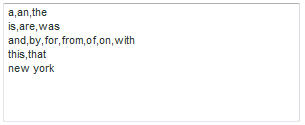

# Info over Uitgesloten woorden{#about-excluded-words}

U kunt Uitgesloten woorden gebruiken om veelgebruikte woordgroepen en veelgebruikte woorden, zoals &quot;a&quot; en &quot;het&quot;, op te geven die u uit zoekresultaten wilt weglaten.

## Uitgesloten woorden {#concept_9DB67BD2F0DC43AC88741003D9F39812} gebruiken

Zie ook [Informatie over zoekopdrachten](../c-about-settings-menu/c-about-searching-menu.md#concept_207105CF26B1448F8A3D223787C56AB8).

Zonder Uitgesloten woorden kunnen zoekopdrachten met deze woorden vele irrelevante resultaten opleveren. Wanneer u woorden en woordgroepen uitschakelt, worden de zoekresultaten weggelaten die alleen overeenkomen met de uitgesloten termen die u hebt opgegeven. Als een zoekquery een uitgesloten woord bevat, worden alleen de niet-uitgesloten woorden gebruikt om documenten te zoeken.

Uitgesloten zoekwoorden worden niet gemarkeerd in de zoekresultaten. De relevantiescore van elk resultaat wordt echter beïnvloed door de uitgesloten woorden. Met andere woorden, uitgesloten woorden worden genegeerd bij het zoeken naar documenten, maar worden nog steeds gebruikt bij het plaatsen van de volgorde van de documenten op de pagina met zoekresultaten. Voordat de effecten van de instellingen voor Uitgesloten woorden (of wijzigingen in deze instellingen) beschikbaar zijn voor klanten, moet u de index van de site opnieuw genereren.

Wanneer u woorden invoert om deze uit te sluiten van de zoekresultaten, scheidt u woorden of woordgroepen met komma&#39;s van elkaar. U kunt een of meer woorden per regel uitsluiten. Hier volgt een voorbeeld van uitgesloten woorden op afzonderlijke regels en gedeeld door komma&#39;s.

Als uw klant met de voorbeeldlijst met uitgesloten woorden hierboven naar &quot;de Verenigde Staten van Amerika&quot; zoekt, worden het woord &quot;de&quot; en het woord &quot;van&quot; van de zoekopdracht uitgesloten. In plaats daarvan zoekt de zoekopdracht naar alle pagina&#39;s die de woorden &quot;verenigd&quot;, &quot;staten&quot; en &quot;amerika&quot; bevatten. Pagina&#39;s die alleen het woord &quot;van&quot; of &quot;het&quot; bevatten, worden niet weergegeven.

Sommige sites bevatten specifieke zinnen op de meeste of alle pagina&#39;s. Een website over toerisme in New York zou bijvoorbeeld de woorden New York kunnen bevatten in de titel van elke pagina. U kunt deze zin en andere functies toevoegen aan de lijst met uitsluitingen:

Wanneer een woordgroep wordt uitgesloten, worden de afzonderlijke woorden waaruit deze bestaat nog steeds gebruikt als zoektermen. Alleen wanneer een bezoeker de exacte woorden zoekt, in de exacte volgorde van een uitgesloten woordgroep, is de woordgroep die is uitgesloten van de zoekresultaten. In het bovenstaande voorbeeld worden het woord &quot;the&quot; en de zinsnede &quot;new york&quot; uitgesloten als een klant naar het &quot;new york ballet&quot; heeft gezocht. alleen pagina&#39;s met het woord &quot;ballet&quot; worden geretourneerd als zoekresultaat. Bij een zoekopdracht naar &quot;nieuwe gebouwen&quot; of &quot;duke of york&quot; worden echter nog steeds pagina&#39;s gevonden die respectievelijk het woord &quot;nieuw&quot; of &quot;geur&quot; bevatten.

## Uitgesloten woorden {#task_60BF6BB7A66C48479D2BBB32C0F38CDE} configureren

U kunt veelgebruikte woordgroepen en veelgebruikte woorden uitsluiten van de zoekresultaten.

U kunt een of meer woorden per regel invoeren. Scheid elk woord met komma&#39;s zoals in het volgende voorbeeld:

U kunt zoekresultaten weergeven wanneer alle woorden in de zoekopdracht van de klant geen woorden zijn. Als u bijvoorbeeld het woord &quot;the&quot; hebt uitgesloten en een klant ervoor kiest alleen naar &quot;the&quot; te zoeken, wordt in de zoekresultaten elke pagina weergegeven die het woord &quot;the&quot; bevat. Dit resultaat is waar, ook al is het woord &quot;the&quot; uitgesloten. Als u deze optie niet inschakelt, krijgt de klant geen zoekresultaten. Deze instelling heeft geen effect als de zoekopdracht ten minste één niet-uitgesloten woord bevat.

**Uitgesloten woorden configureren**

1. Klik in het productmenu op **[!UICONTROL Linguistics]** > **[!UICONTROL Excluded Words]**.
1. Voer op de pagina [!DNL Excluded Words] in het tekstveld **[!UICONTROL Words and Phrases]** de woorden in die u wilt uitsluiten van zoekresultaten.
1. (Optioneel) Klik op **[!UICONTROL Show results when all words in the query are excluded words]**.

   Wanneer alle woorden in de zoekopdracht van de klant geen woorden zijn, worden alle woorden samen gebruikt om de zoekopdracht uit te voeren.
1. Klik op **[!UICONTROL Save Changes]**.
1. Als u de resultaten van uw wijzigingen wilt bekijken, klikt u op **[!UICONTROL regenerate your staged site index]** om de gefaseerde website-index opnieuw samen te stellen.

   Zie [Een volledige index van een actieve of gefaseerde website uitvoeren...](../c-about-index-menu/c-about-full-index.md#task_F7FE04D8A1654A7787FCCA31B45EB42D).

   Zie [Een incrementele index van een actieve of gefaseerde website uitvoeren...](../c-about-index-menu/c-about-incremental-index.md#task_9BFB6157F3884B2FAECB7E0E9CA318CB).
1. (Optioneel) Klik in het productmenu op **[!UICONTROL Linguistics]** > **[!UICONTROL Excluded Words]** en voer een van de volgende handelingen uit:

   * Klik **[!UICONTROL History]** om het even welke veranderingen terug te keren die u hebt aangebracht.

      Zie [De optie Historie gebruiken](../t-using-the-history-option.md#task_70DD3F87A67242BBBD2CB27156F43002).

   * Klik op **[!UICONTROL Live]**.

      Zie [Live-instellingen weergeven](../c-about-staging.md#task_401A0EBDB5DB4D4CA933CBA7BECDC10F).

   * Klik op **[!UICONTROL Push Live]**.

      Zie [Werkgebiedinstellingen leegmaken live](../c-about-staging.md#task_44306783B4C0408AAA58B471DAF2D9A4).
